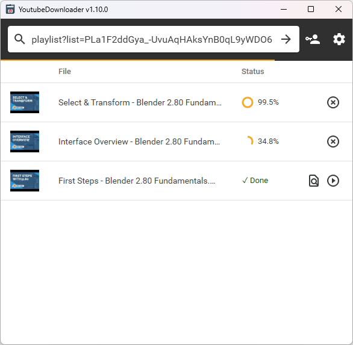
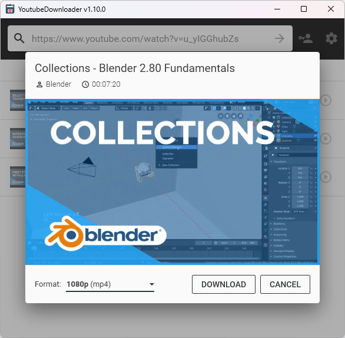
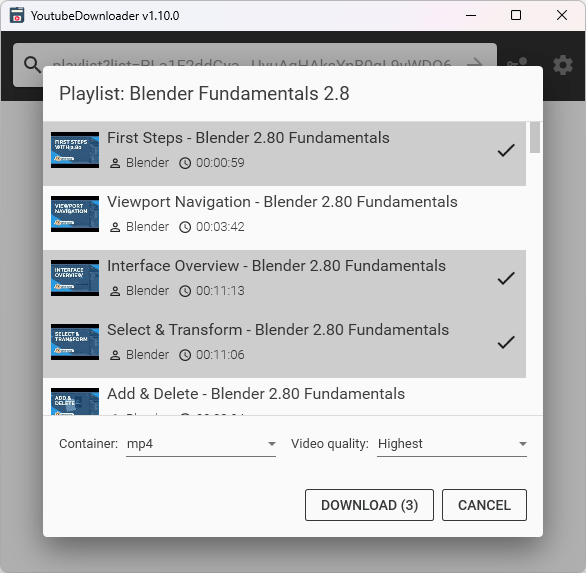

### Hi there 👋

<!--
**iprompt-x/iprompt-x** is a ✨ _special_ ✨ repository because its `README.md` (this file) appears on your GitHub profile.

Here are some ideas to get you started:

- 🔭 I’m currently working on ...
- 🌱 I’m currently learning ...
- 👯 I’m looking to collaborate on ...
- 🤔 I’m looking for help with ...
- 💬 Ask me about ...
- 📫 How to reach me: ...
- 😄 Pronouns: ...
- ⚡ Fun fact: ...
-->

  

    <a href="#">
      

    </a>
  

  
  
  

### Skills

  
    

# YoutubeDownloader

<table>
    <tr>
        <td width="99999" align="center">Development of this project is entirely funded by the community. <b><a href="#">Consider donating to support!</a></b></td>
    </tr>
</table>
<a href="#">
    

    
    
 </a>

**YoutubeDownloader** เป็นแอพพลิเคชั่นที่ให้คุณดาวน์โหลดวิดีโอจาก YouTube
คุณสามารถคัดลอกวาง URL ของวิดีโอ เพลย์ลิสต์ หรือช่องใดก็ได้ และดาวน์โหลดโดยตรงไปยังรูปแบบที่คุณต้องการ
นอกจากนี้ยังรองรับการค้นหาด้วยคำหลักซึ่งมีประโยชน์หากคุณต้องการค้นหาและดาวน์โหลดวิดีโออย่างรวดเร็ว

> **Note**:
> This application uses [**YoutubeExplode**](https://github.com/Tyrrrz/YoutubeExplode) under the hood to interact with YouTube.
> You can [read this article](https://tyrrrz.me/blog/reverse-engineering-youtube-revisited) to learn more about how it works.

## Terms of use[[?]](https://github.com/Tyrrrz/.github/blob/master/docs/why-so-political.md)

By using this project or its source code, for any purpose and in any shape or form, you grant your **implicit agreement** to all the following statements:

## Download

- 🟢 **[Stable release](https://github.com/Tyrrrz/YoutubeDownloader/releases/latest)**
- 🟠 [CI build](https://github.com/Tyrrrz/YoutubeDownloader/actions/workflows/main.yml)

> **Note**:
> If you're unsure which build is right for your system, consult with [this page](https://useragent.cc) to determine your OS and CPU architecture.

> **Note**:
> **YoutubeDownloader** comes bundled with [FFmpeg](https://ffmpeg.org) which is used for processing videos.
> You can also download a version of **YoutubeDownloader** that doesn't include FFmpeg (`YoutubeDownloader.Bare.*` builds) if you prefer to use your own installation.

## Features

- อินเทอร์เฟซผู้ใช้แบบกราฟิกข้ามแพลตฟอร์ม
- ดาวน์โหลดวิดีโอตาม URL
- ดาวน์โหลดวิดีโอจากเพลย์ลิสต์หรือช่อง
- ดาวน์โหลดวิดีโอตามคำค้นหา
- เลือกคุณภาพและรูปแบบวิดีโอได้
- ฝังคำบรรยายอัตโนมัติ
- ใส่แท็กสื่ออัตโนมัติ
- เข้าสู่ระบบด้วยบัญชี YouTube เพื่อเข้าถึงเนื้อหาส่วนตัว

## Screenshots

